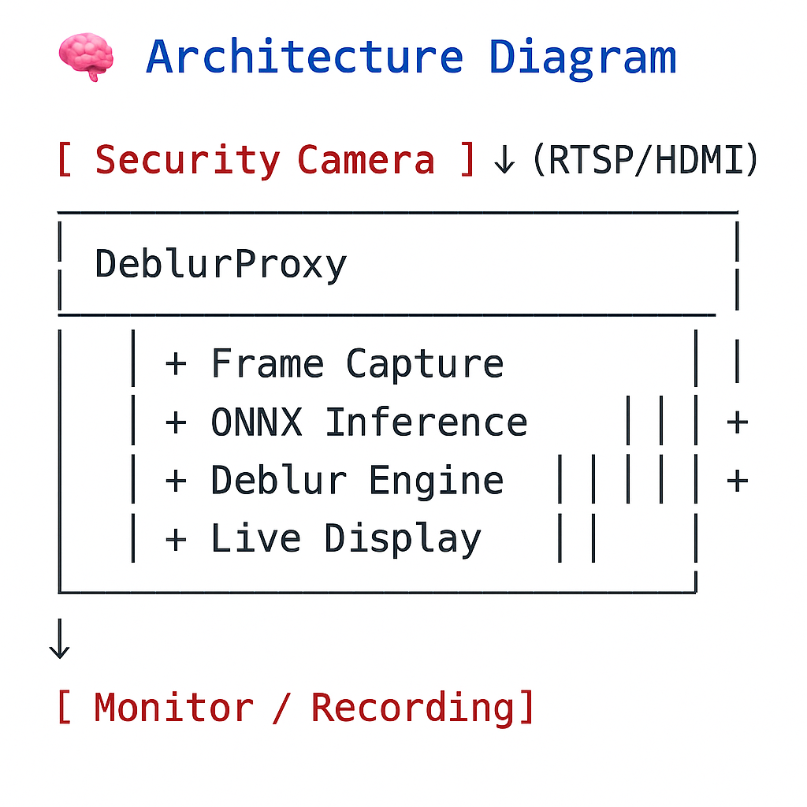

# 🧠 DeblurProxy

> **Real-time AI middleware that deblurs security camera feeds before they hit the screen.**

---

##  Project Status: Planning Phase

This project is currently in the design and planning phase. Implementation will begin shortly. The full pipeline — from AI model training to C++ deployment — has been scoped and outlined below.

---

##  Overview

**DeblurProxy** is an AI-powered middleware application designed to sit between a security camera and its monitor/recording system. It intercepts the video stream (via RTSP or HDMI), applies deep learning-based motion deblurring, and forwards the enhanced frames — all in real-time.

---

##  Problem Statement

Most security camera footage suffers from:
- **Motion blur** during fast movement (e.g., theft, scuffles)
- **Low-light blur** at night
- Poor quality that hinders **identification and evidence collection**

Current surveillance solutions do not offer inline deblurring — enhancements are typically applied *after* recording, if at all.

---

##  Goals

- Intercept camera streams using **RTSP or HDMI**
- Deblur video in real time using an **AI model** (ONNX format)
- Forward the enhanced output to a **monitor or recording system**
- Run on desktops, edge devices, or embedded systems with low latency

---

##  Key Features

- Real-time AI deblurring using ONNX models (e.g., DeblurGANv2, U-Net)
- Python for model training and prototyping
- C++ for high-performance inference and display
- Modular design with optional logging, overlays, and toggles
- Extensible to HDMI input/output or smart NVR systems

---

## 🧠 Architecture Diagram

---

## ⚙️ Tech Stack

| Component         | Tool / Library                   |
|------------------|-----------------------------------|
| Model Training    | Python, PyTorch                   |
| Model Export      | ONNX                              |
| Real-Time Inference| C++, OpenCV, ONNX Runtime        |
| Deployment        | CMake, Docker (optional)          |
| Streaming Input   | RTSP (OpenCV, FFmpeg)             |
| Optional UI       | Qt, SDL2, or CLI Overlay          |

---

## 📁 Folder Structure (Planned)

deblurproxy/
├── python/ # Model training + ONNX export
│ ├── train_model.py
│ ├── export_onnx.py
│ └── simulate_blur.py
├── cpp/ # Real-time C++ inference
│ ├── main.cpp
│ ├── onnx_infer.cpp/.hpp
│ └── video_stream.cpp
├── models/ # Pretrained ONNX models
├── test_videos/ # Sample blur videos
├── deployment/ # Docker, CMakeLists
├── README.md # This file

---

## 📆 7-Day MVP Timeline

| Day | Milestone                                            |
|-----|------------------------------------------------------|
| 1   | RTSP stream capture prototype (Python)               |
| 2   | Model prep: DeblurGAN-lite download & testing        |
| 3   | Python inference test on sample video                |
| 4   | Export model to ONNX                                 |
| 5   | Build C++ app with ONNX Runtime + OpenCV             |
| 6   | Connect full pipeline: stream → deblur → display     |
| 7   | Record demo, polish UI, package executable           |

---

##  Use Cases

- 🏪 Retail store surveillance
- 🚓 Police bodycam live enhancement
- 🏦 Bank/ATM feeds for clearer evidence
- 🚪 Smart home doorbell clarity
- 🛰️ Drone or moving-camera stabilization
- 🎬 Video forensics and post-production boost

---

## Future Enhancements

- HDMI input/output support with capture cards
- Jetson Nano / Raspberry Pi 5 optimization
- Optional GUI frontend for toggles & recording
- Multi-camera dashboard + alerts
- Real-time license plate / face zoom after deblur

---

## Why This Project Matters

- Solves a **real, neglected problem** in surveillance tech
- Offers a **non-invasive upgrade** to existing camera systems
- Demonstrates **AI, systems engineering, and deployment** in one package
- Useful for security firms, law enforcement, retail, and beyond

---

## Author
**[Durga Deepak Valluri]**  
---
