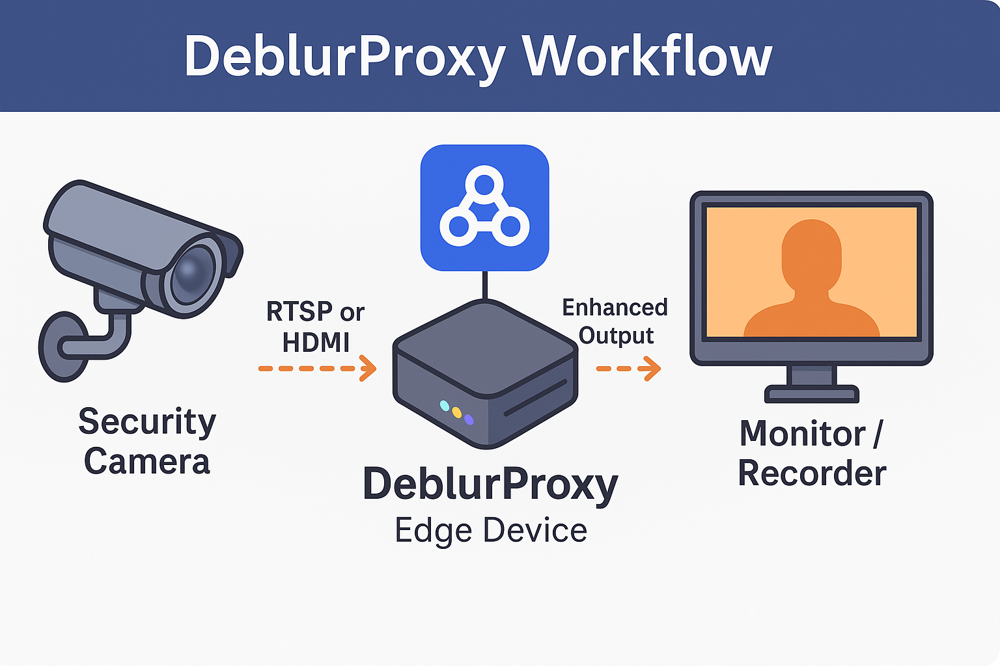

# 🧠 DeblurProxy

**Real-time AI middleware that deblurs blurry security camera footage before it reaches the screen or storage.**

---

## 🚧 Project Status

**Planned** — Currently in the design and planning phase. Development to begin soon.

---

## 🔍 Overview

DeblurProxy is a real-time video enhancement system that sits between a security camera and a display or recording system. It intercepts RTSP or HDMI video feeds, processes them using a deep learning model to remove motion blur, and outputs the improved stream for monitoring or storage — all in real time.

---

## 🎯 Problem It Solves

- Motion blur during fast movement (e.g., theft, running)
- Low-light blur at night
- Unreadable surveillance footage
- No native real-time enhancement in most camera systems

---

## 🚀 Goals

- Capture video stream via RTSP or HDMI
- Deblur frames in real time using an AI model
- Forward enhanced output to a monitor or recorder
- Maintain low latency, edge compatibility, and modularity

---

## 🛠️ Key Features

- Real-time ONNX model inference using C++ and OpenCV
- Modular architecture for plug-and-play AI models
- Python training pipeline with ONNX export
- Optional frame overlays, toggles, and save modes
- Designed to work without modifying existing camera hardware
- Fully compatible with Raspberry Pi and other edge devices

---

## ⚙️ Tech Stack

| Component           | Tool / Library            |
|--------------------|---------------------------|
| Model Training      | Python, PyTorch           |
| Model Export        | ONNX                      |
| Real-Time Inference | C++, OpenCV, ONNX Runtime |
| Deployment          | CMake, Docker (optional)  |
| Streaming Input     | RTSP (OpenCV, FFmpeg)     |
| Display Output      | Monitor, Recorder         |
| Platform Support    | Desktop, Raspberry Pi     |

---

## 🗂️ Folder Structure (Planned)

- `python/` – Model training and ONNX export
- `cpp/` – Real-time inference and display logic
- `models/` – ONNX model files
- `test_videos/` – Blurred samples for testing
- `deployment/` – Build and packaging scripts
- `README.md` – Project documentation

---

## 📅 MVP Timeline (7-Day Plan)

| Day | Task                                                 |
|-----|------------------------------------------------------|
| 1   | Set up RTSP capture (Python)                         |
| 2   | Download/test pretrained deblurring model            |
| 3   | Build Python pipeline to test blur → deblur          |
| 4   | Export model to ONNX                                 |
| 5   | Implement C++ inference using ONNX Runtime + OpenCV  |
| 6   | Integrate full pipeline: input → deblur → output     |
| 7   | Record demo video and polish code                    |

---

## 📌 Use Cases

- Retail stores needing clear security footage
- Police departments with bodycam feeds
- Banks and ATMs requiring enhanced facial/video evidence
- Doorbell and smart home cameras
- Drone or robotic camera footage stabilization
- Forensic analysts enhancing surveillance video

---

## 🔮 Future Enhancements

- HDMI pass-through support with capture cards
- GPU optimization for Jetson, NVIDIA boards, or Coral TPU
- Real-time zoom on faces or license plates
- Web-based control panel for toggling settings
- Saving both raw and deblurred feeds

---

## Author
**Durga Deepak Valluri**  
---
